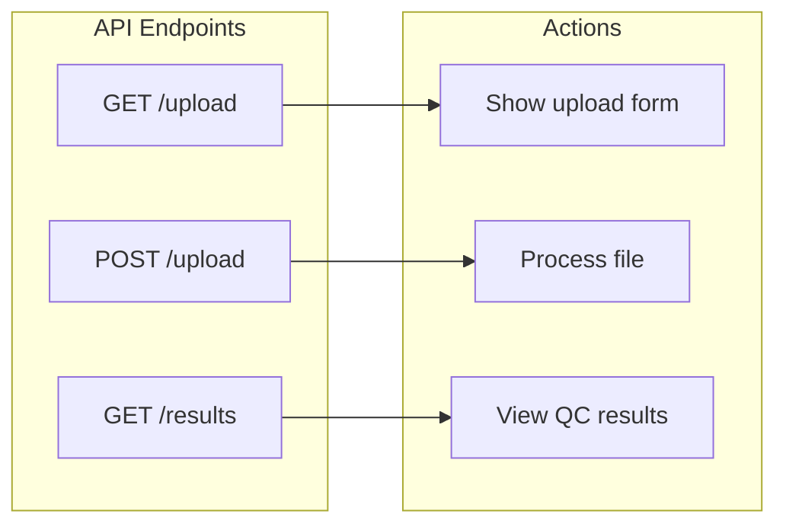
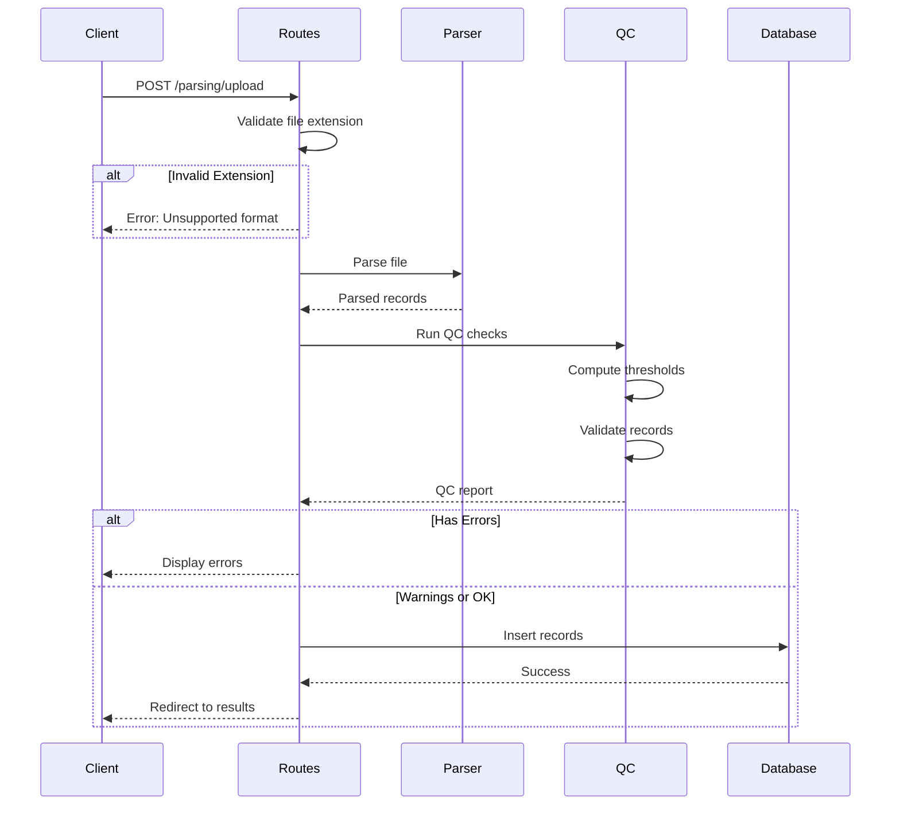
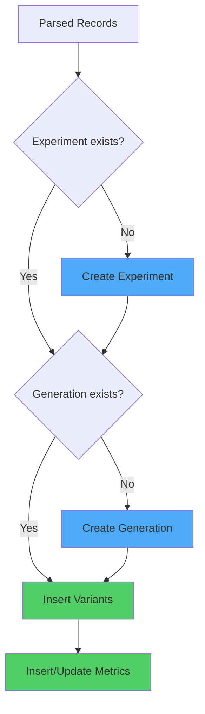

# API Reference

REST API endpoints for the parsing and QC system.

---

## Base URL

```
http://localhost:5000/parsing
```

---

## Endpoints Overview



| Method | Endpoint | Description |
|--------|----------|-------------|
| `GET` | `/parsing/upload` | Display upload form |
| `POST` | `/parsing/upload` | Upload and process file |
| `GET` | `/parsing/results` | View processing results |

---

## Upload Form

### `GET /parsing/upload`

Returns the HTML upload form.

**Response:** HTML page with file upload form

---

## Upload File

### `POST /parsing/upload`

Upload a TSV or JSON file for parsing and QC validation.

#### Request

| Parameter | Type | Required | Description |
|-----------|------|----------|-------------|
| `file` | File | ✅ | TSV or JSON data file |
| `experiment_name` | String | ❌ | Experiment identifier |

**Content-Type:** `multipart/form-data`

#### Example Request

=== "cURL"

    ```bash
    curl -X POST http://localhost:5000/parsing/upload \
      -F "file=@data/DE_BSU_Pol_Batch_1.tsv" \
      -F "experiment_name=BSU_Pol_Experiment"
    ```

=== "Python"

    ```python
    import requests
    
    url = "http://localhost:5000/parsing/upload"
    files = {"file": open("data/experiment.tsv", "rb")}
    data = {"experiment_name": "BSU_Pol_Experiment"}
    
    response = requests.post(url, files=files, data=data)
    print(response.text)
    ```

=== "JavaScript"

    ```javascript
    const formData = new FormData();
    formData.append("file", fileInput.files[0]);
    formData.append("experiment_name", "BSU_Pol_Experiment");
    
    fetch("/parsing/upload", {
      method: "POST",
      body: formData
    })
    .then(response => response.text())
    .then(html => console.log(html));
    ```

---

#### Response

**Success (redirect to results page):**

```http
HTTP/1.1 302 Found
Location: /parsing/results
```

**Error (HTML with error details):**

```http
HTTP/1.1 200 OK
Content-Type: text/html

<!-- Upload form with error messages -->
```

---

## Processing Flow



---

## Response Structures

### QC Report (Internal)

```python
{
    "status": "success" | "warnings" | "error",
    "total_records": int,
    "errors": [
        {
            "row": int,
            "field": str,
            "value": any,
            "message": str,
            "severity": "error"
        }
    ],
    "warnings": [
        {
            "row": int,
            "field": str,
            "value": any,
            "message": str,
            "severity": "warning"
        }
    ],
    "thresholds_used": {
        "dna_yield_low": float,
        "dna_yield_high": float,
        "protein_yield_low": float,
        "protein_yield_high": float
    }
}
```

---

## Error Codes

| Status | Meaning | Cause |
|--------|---------|-------|
| 200 | OK | Form displayed or error shown in form |
| 302 | Redirect | Successful upload, redirecting to results |
| 400 | Bad Request | Missing file or invalid format |
| 500 | Server Error | Database or parsing failure |

---

## Database Operations

### Insert Flow



### Tables Affected

| Table | Operation | Description |
|-------|-----------|-------------|
| `experiments` | INSERT | Create if not exists |
| `generations` | INSERT | Create if not exists |
| `variants` | INSERT | New variant records |
| `metrics` | UPSERT | Insert or update on conflict |

---

## Rate Limits

!!! info "No Rate Limiting"
    The current implementation has no rate limiting. For production deployment, consider adding request throttling.

---

## Authentication

!!! warning "No Authentication"
    The current implementation has no authentication. Database credentials are configured server-side.

---

## Extending the API

To add new endpoints, modify `parsing/routes.py`:

```python
@parsing_bp.route('/api/status', methods=['GET'])
def api_status():
    """Health check endpoint."""
    return jsonify({
        "status": "healthy",
        "version": "1.0.0"
    })
```

---

## Related Topics

- [Getting Started](../guide/getting-started.md) - Setup instructions
- [File Formats](../guide/file-formats.md) - Supported file types
