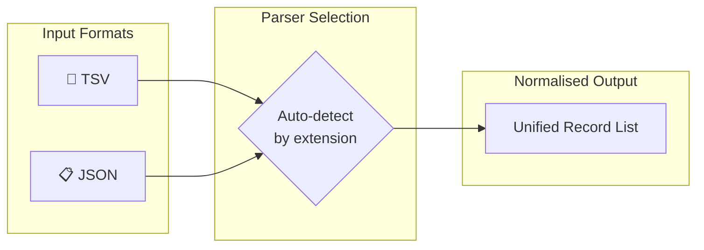
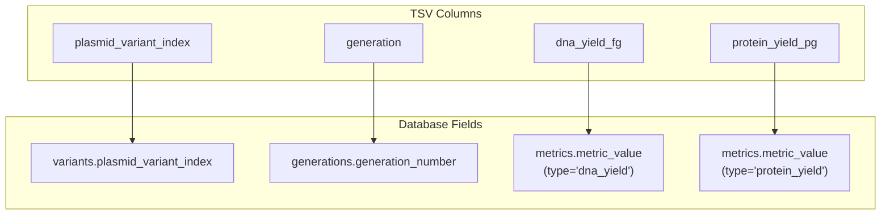
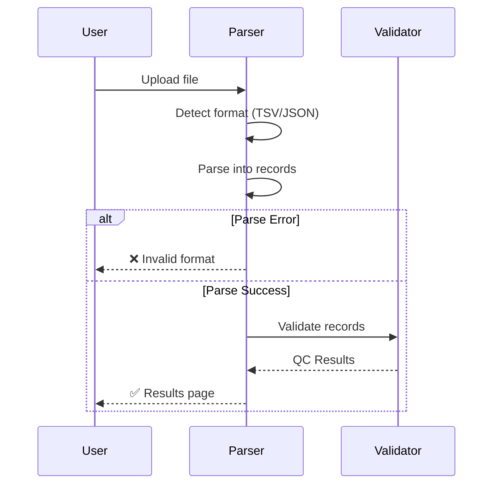

# Supported File Formats

The parsing system supports TSV and JSON file formats for uploading variant data.

---

## Format Comparison



| Feature | TSV | JSON |
|---------|-----|------|
| **Best for** | Excel exports, simple data | Nested data, metadata |
| **Extension** | `.tsv` | `.json` |
| **Schema flexibility** | Column-based | Field-based |
| **Human readable** | ✅ Easily | ⚠️ Somewhat |
| **Metadata support** | ❌ Limited | ✅ Full |

---

## TSV Format

### Structure

Tab-separated values with a header row.

```tsv title="example.tsv"
plasmid_variant_index	generation	dna_yield_fg	protein_yield_pg
BSU_Pol_001	G0	1523.45	456.78
BSU_Pol_002	G0	1678.90	512.34
BSU_Pol_003	G0	1234.56	389.12
```

### Required Columns

| Column | Type | Description |
|--------|------|-------------|
| `plasmid_variant_index` | String | Unique variant identifier |
| `generation` | String | Generation label (`G0`, `G1`, etc.) |
| `dna_yield_fg` | Float | DNA yield in femtograms |
| `protein_yield_pg` | Float | Protein yield in picograms |

### Optional Columns

Any additional columns are preserved as extra metadata:

```tsv
plasmid_variant_index	generation	dna_yield_fg	protein_yield_pg	notes	plate_position
BSU_Pol_001	G0	1523.45	456.78	Wild type	A1
```

### Column Name Flexibility

The parser handles common variations:

=== "Standard Names"
    ```
    plasmid_variant_index
    dna_yield_fg
    protein_yield_pg
    ```

=== "Alternative Names"
    ```
    variant_id, variant_index, plasmid_id
    dna_yield, dna_fg, yield_dna_fg
    protein_yield, protein_pg, yield_protein_pg
    ```

---

## JSON Format

### Structure

Array of variant objects with consistent field names.

```json title="example.json"
[
  {
    "plasmid_variant_index": "BSU_Pol_001",
    "generation": "G0",
    "dna_yield_fg": 1523.45,
    "protein_yield_pg": 456.78
  },
  {
    "plasmid_variant_index": "BSU_Pol_002",
    "generation": "G0",
    "dna_yield_fg": 1678.90,
    "protein_yield_pg": 512.34
  }
]
```

### With Metadata

JSON supports rich metadata:

```json title="example_with_metadata.json"
{
  "experiment_name": "DE_BSU_Pol_Batch_1",
  "created_date": "2026-02-10",
  "user": "rp1284",
  "variants": [
    {
      "plasmid_variant_index": "BSU_Pol_001",
      "generation": "G0",
      "dna_yield_fg": 1523.45,
      "protein_yield_pg": 456.78,
      "metadata": {
        "plate": "Plate_1",
        "well": "A1",
        "selection_pressure": 0.5
      }
    }
  ]
}
```

---

## Field Mapping



---

## Real Data Examples

### From Your Data

=== "TSV (DE_BSU_Pol_Batch_1.tsv)"
    
    ```tsv
    plasmid_variant_index	generation	dna_yield_fg	protein_yield_pg
    BSU_Pol_001	G0	1523.45	456.78
    BSU_Pol_002	G0	1678.90	512.34
    ...
    ```

=== "JSON (DE_BSU_Pol_Batch_1.json)"
    
    ```json
    [
      {
        "plasmid_variant_index": "BSU_Pol_001",
        "generation": "G0",
        "dna_yield_fg": 1523.45,
        "protein_yield_pg": 456.78
      }
    ]
    ```

---

## Validation on Upload



---

## Common Issues

!!! warning "Encoding"
    Files must be UTF-8 encoded. Excel exports may use Windows-1252 by default—save as "CSV UTF-8" or "Unicode Text".

!!! warning "TSV vs CSV"
    The parser expects **tabs** as separators. If using CSV (commas), save as TSV first or modify the delimiter.

!!! warning "Empty Rows"
    Trailing empty rows are ignored. Rows with partial data generate errors.

---

## Creating Compatible Files

### From Excel

1. Open your data in Excel
2. Ensure columns match required names
3. File → Save As → Select "Text (Tab delimited) (*.txt)"
4. Rename `.txt` to `.tsv`

### From Python

```python
import pandas as pd

df = pd.DataFrame({
    'plasmid_variant_index': ['BSU_001', 'BSU_002'],
    'generation': ['G0', 'G0'],
    'dna_yield_fg': [1523.45, 1678.90],
    'protein_yield_pg': [456.78, 512.34]
})

# TSV export
df.to_csv('output.tsv', sep='\t', index=False)

# JSON export
df.to_json('output.json', orient='records', indent=2)
```

---

## Related Topics

- [Getting Started](getting-started.md) - Setup walkthrough
- [Uploading Data](uploading-data.md) - Step-by-step upload guide
