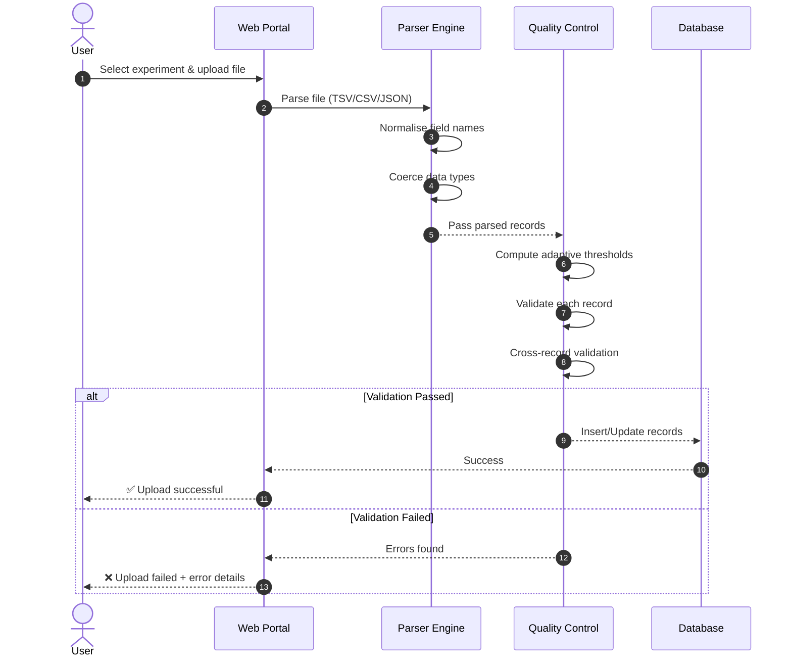
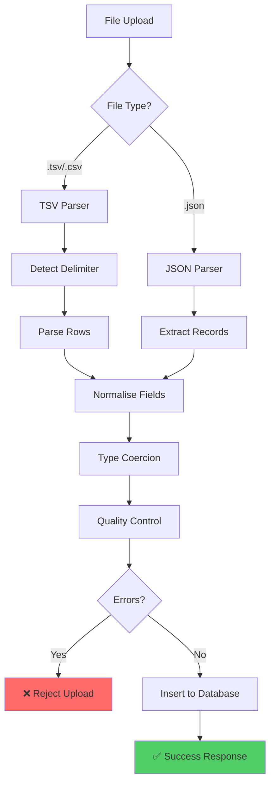

# Getting Started

This guide walks you through uploading your first experimental dataset.

---

## Prerequisites

Before uploading data, ensure:

- [x] You have access to the web portal
- [x] Your data file is in TSV, CSV, or JSON format
- [x] Required fields are present (see [File Formats](file-formats.md))

---

## Repository Layout (Team Standard)

Use this structure so app logic and scripts stay predictable:

- app/ : Flask app code (blueprints, services, jobs, templates, static)
- app/services/ : Reusable domain logic (parsing, QC, analysis, sequence)
- app/jobs/ : Long-running or CLI-invoked jobs
- scripts/ : One-off utilities and maintenance tasks
- docs/ : Documentation
- tests/ : Test suites
- data/ : Sample or local data files

If a script becomes reused by the app, move it into app/services/ and keep only a thin CLI wrapper in scripts/.

---

## Upload Workflow



---

## Step-by-Step Instructions

### 1. Access the Upload Page

Navigate to:

```
http://your-server:5000/parsing/upload
```

Or click **"Upload Data"** from the main navigation.

---

### 2. Select an Experiment

Choose from the dropdown or enter a new experiment ID:

!!! info "New Experiments"
    If you enter a new experiment ID, it will be automatically created when you upload data.

---

### 3. Choose Your File

Click **"Choose File"** and select your data file.

| Format | Extension | Notes |
|--------|-----------|-------|
| Tab-separated | `.tsv` | Most common format |
| Comma-separated | `.csv` | Auto-detected |
| JSON | `.json` | Array or nested structure |

!!! warning "File Size Limit"
    Maximum file size: **50 MB**

---

### 4. Upload and Review

Click **"Upload"** to process your file. You'll see one of two outcomes:

=== "Success"

    ```
    ✅ Upload Successful
    
    Total Records: 301
    Inserted: 285
    Updated: 16
    Warnings: 3
    ```

=== "Failure"

    ```
    ❌ Upload Failed
    
    Errors:
    - Row 23: Missing required field 'variant_index'
    - Duplicate variant indices found: [15, 42]
    ```

---

## What Happens Behind the Scenes



---

## Next Steps

- Learn about [File Formats](file-formats.md) and required fields
- Understand the [Quality Control System](../qc/overview.md)
- Review [Troubleshooting](../troubleshooting.md) for common issues
