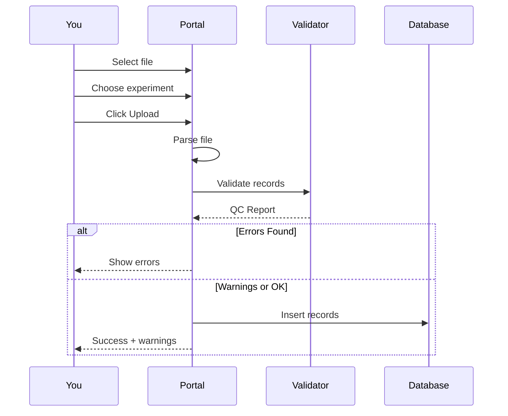
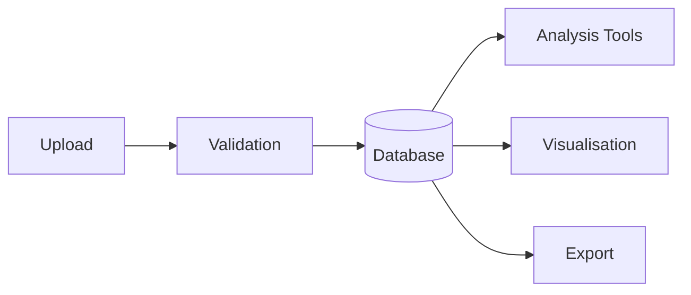

# Uploading Data

Step-by-step guide for uploading experimental data to the system.

---

## Upload Workflow



---

## Step 1: Access the Upload Page

Navigate to:

```
http://localhost:5000/parsing/upload
```

You'll see the upload form with:

- **Experiment selector** - Choose or create an experiment
- **File input** - Select your data file
- **Upload button** - Submit for processing

---

## Step 2: Prepare Your Data

Ensure your file meets these requirements:

| Requirement | Details |
|-------------|---------|
| **Format** | TSV or JSON |
| **Encoding** | UTF-8 |
| **Required fields** | `plasmid_variant_index`, `generation`, `dna_yield_fg`, `protein_yield_pg` |

!!! tip "Check Your Headers"
    The parser recognises common column name variations. See [File Formats](file-formats.md) for accepted names.

---

## Step 3: Select Your File

1. Click **Choose File** or drag-and-drop
2. Select your `.tsv` or `.json` file
3. Verify the filename appears next to the button

---

## Step 4: Choose Experiment

=== "Existing Experiment"
    Select from the dropdown list of existing experiments.

=== "New Experiment"
    The system auto-creates an experiment if it doesn't exist.

---

## Step 5: Upload

Click the **Upload** button to:

1. Parse your file
2. Validate all records
3. Compute adaptive thresholds
4. Check against critical limits
5. Insert valid records to database

---

## Understanding Results

### Success with Warnings

```
✅ Upload Successful

Summary:
- Total Records: 301
- Inserted: 285
- Warnings: 3

⚠️ Warnings:
- Row 45: DNA yield (312.5 fg) below P1 threshold
- Row 198: Protein yield (1847.3 pg) above P99 threshold
```

**Action:** Review flagged records but no re-upload needed.

---

### Upload Rejected

```
❌ Upload Failed

🚫 Errors:
- Row 23: Missing required field: variant_index
- Row 89: DNA yield (250 fg) below critical minimum (300 fg)
```

**Action:** Fix the errors in your source file and re-upload.

---

## Common Upload Issues

| Issue | Cause | Solution |
|-------|-------|----------|
| "Unsupported format" | Wrong file extension | Use `.tsv` or `.json` |
| "Missing required field" | Column name mismatch | Check column headers |
| "Below critical minimum" | Value too low | Check measurement/units |
| "Connection timed out" | Database unreachable | Check Tailscale connection |

---

## Tips for Successful Uploads

!!! success "Best Practices"
    - **Validate locally first**: Check your data in Excel/Python before uploading
    - **Use consistent naming**: Stick to standard column names
    - **Include Generation 0**: Always include wild-type controls
    - **Check units**: DNA in femtograms, protein in picograms

---

## What Happens After Upload



Your data is now available for:

- **Analysis** by other team members
- **Visualisation** in the dashboard
- **Export** for downstream processing

---

## Related Topics

- [File Formats](file-formats.md) - Detailed format specifications
- [QC Overview](../qc/overview.md) - Understanding thresholds
- [Troubleshooting](../troubleshooting.md) - Common issues
