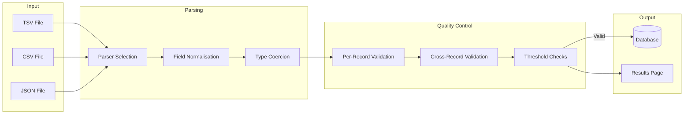

# BIO727P Data Parsing & Quality Control

Welcome to the documentation for the **Data Parsing & Quality Control Module** of the BIO727P Directed Evolution Web Portal.

<div class="grid cards" markdown>

-   :material-upload:{ .lg .middle } __Upload Data__

    ---

    Upload TSV, CSV, or JSON experimental data files with automatic parsing and validation.

    [:octicons-arrow-right-24: Getting Started](guide/getting-started.md)

-   :material-check-circle:{ .lg .middle } __Quality Control__

    ---

    Two-tier validation system with adaptive thresholds and critical safety limits.

    [:octicons-arrow-right-24: QC Overview](qc/overview.md)

-   :material-api:{ .lg .middle } __API Reference__

    ---

    REST API endpoints for programmatic data upload and validation.

    [:octicons-arrow-right-24: API Docs](api/endpoints.md)

-   :material-help-circle:{ .lg .middle } __Troubleshooting__

    ---

    Common issues and solutions for data upload problems.

    [:octicons-arrow-right-24: Get Help](troubleshooting.md)

</div>

---

## Quick Start

```bash
# Navigate to the upload page
http://your-server:5000/parsing/upload
```

1. Select or create an experiment
2. Choose your data file (TSV, CSV, or JSON)
3. Click Upload
4. Review validation results

---

## System Architecture



---

## Key Features

| Feature | Description |
|---------|-------------|
| **Multi-format Support** | Parse TSV, CSV, and JSON files with automatic format detection |
| **Dynamic Schema** | Accept additional metadata columns without configuration changes |
| **Adaptive Thresholds** | Percentile-based warnings adjust to each dataset |
| **Critical Limits** | Fixed safety bounds catch impossible values |
| **Batch Processing** | Efficient upsert operations for large datasets |

---

## Version

- **Module Version**: 1.0.0
- **Last Updated**: February 2026
