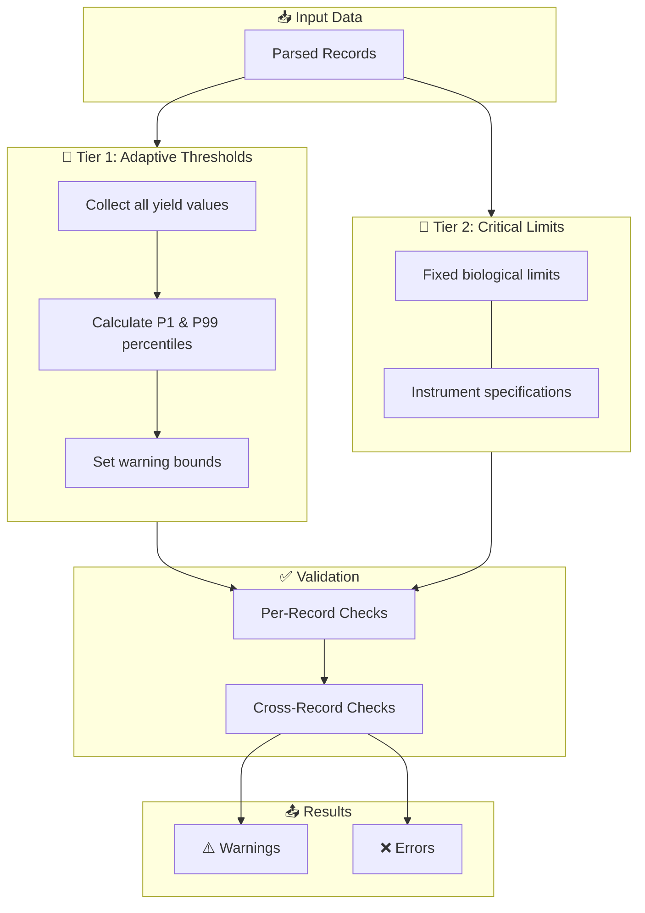
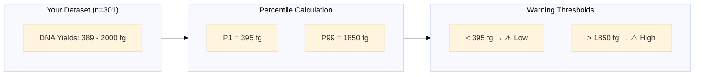
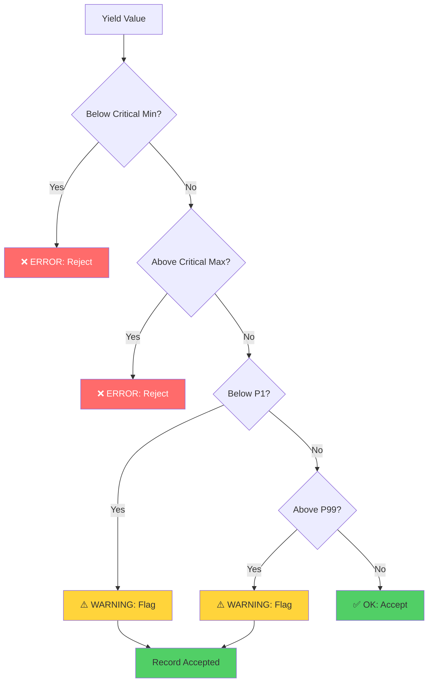

# Quality Control Overview

The QC system uses a **two-tier threshold architecture** to identify data quality issues while accommodating batch-to-batch variation.

---

## Architecture Overview



---

## Two-Tier Threshold System

### Tier 1: Adaptive Warnings (Percentile-Based)

Warnings flag **statistical outliers** relative to the current dataset.



**Why percentiles?**

| Method | Problem |
|--------|---------|
| Fixed thresholds | Don't adapt to batch variation |
| Mean ± 2σ (Z-scores) | Assumes normal distribution |
| **P1/P99 Percentiles** | ✅ Non-parametric, robust to skew |

---

### Tier 2: Critical Errors (Fixed Limits)

Errors flag values that are **biologically impossible** or indicate instrument failure.

| Metric | Critical Min | Critical Max | Rationale |
|--------|--------------|--------------|-----------|
| DNA Yield | 300 fg | 5,000 fg | Below detection / saturation |
| Protein Yield | 20 pg | 2,000 pg | Expression system limits |

!!! danger "Critical Limit Violations"
    Values outside critical limits **always generate errors** and the upload is rejected.

---

## Threshold Visualisation

```
DNA Yield Thresholds
═══════════════════════════════════════════════════════════════════════════════

     0        300              P1            MEDIAN           P99           5000
     │         │                │               │               │              │
     ▼         ▼                ▼               ▼               ▼              ▼
─────┴─────────┼────────────────┼───────────────┼───────────────┼──────────────┴─────
     │  ERROR  │    WARNING     │      OK       │    WARNING    │     ERROR    │
     │ (reject)│  (flag only)   │   (accept)    │  (flag only)  │   (reject)   │
     └─────────┴────────────────┴───────────────┴───────────────┴──────────────┘
         ▲                            ▲                              ▲
         │                            │                              │
    Instrument                   Batch-specific                 Instrument
    Detection                    percentiles                    Saturation
    Limit                                                       Limit
```

---

## Configuration

Thresholds are configured in `parsing/config.py`:

=== "Adaptive Settings"

    ```python
    # Percentile-based thresholds
    QC_PERCENTILE_MODE = True
    QC_PERCENTILE_LOW = 1.0      # P1
    QC_PERCENTILE_HIGH = 99.0    # P99
    QC_MIN_SAMPLES_FOR_PERCENTILES = 30
    ```

=== "Critical Limits"

    ```python
    # Absolute safety limits
    DNA_YIELD_CRITICAL_MIN = 300.0
    DNA_YIELD_CRITICAL_MAX = 5000.0
    PROTEIN_YIELD_CRITICAL_MIN = 20.0
    PROTEIN_YIELD_CRITICAL_MAX = 2000.0
    ```

---

## Decision Flow



---

## Benefits of This Approach

!!! success "Adaptive to Each Experiment"
    Different batches, reagent lots, and assay conditions produce different expected ranges. Percentile-based thresholds automatically adjust.

!!! success "Catches Real Errors"
    Critical limits based on physical reality ensure impossible values are always flagged.

!!! success "Reduces False Positives"
    Using P1/P99 (not P5/P95) means only the most extreme 2% of values are flagged, reducing noise.

!!! success "Non-Parametric"
    Works correctly even when yield distributions are skewed (common in biological data).

---

## Related Topics

- [Validation Checks](validation-checks.md) - Detailed list of all checks
- [Threshold Configuration](thresholds.md) - How to customise thresholds
