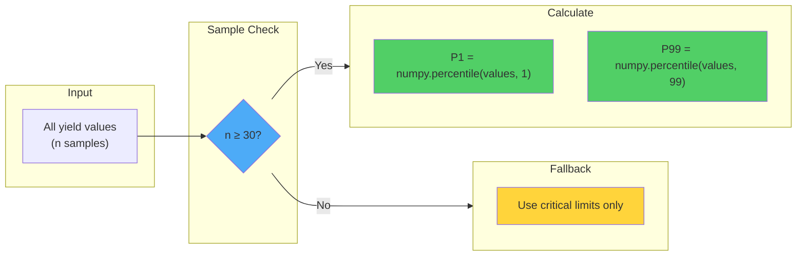
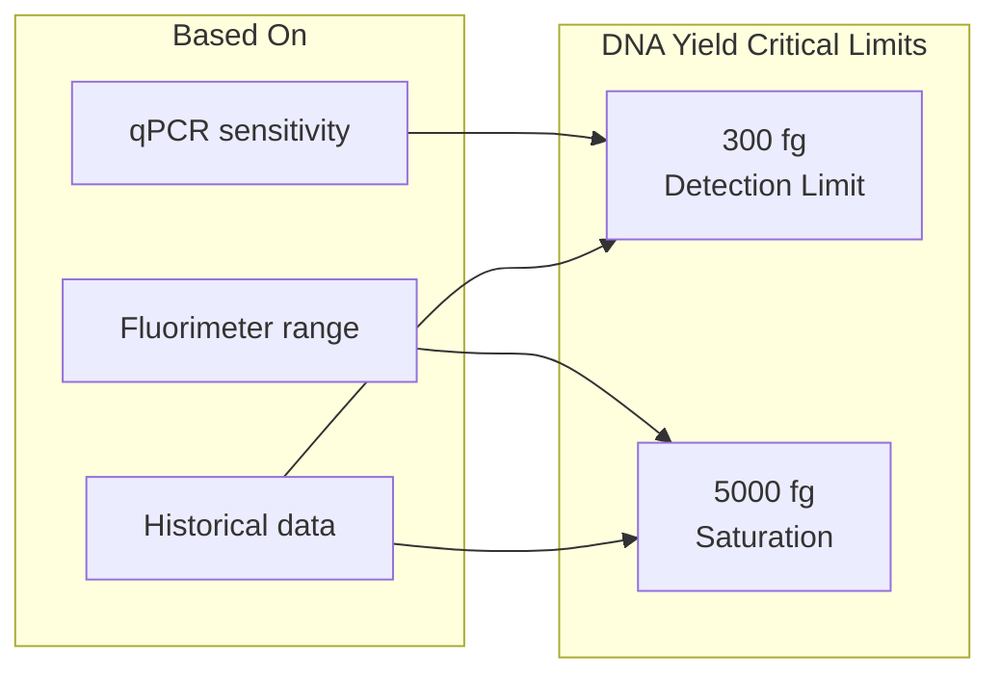
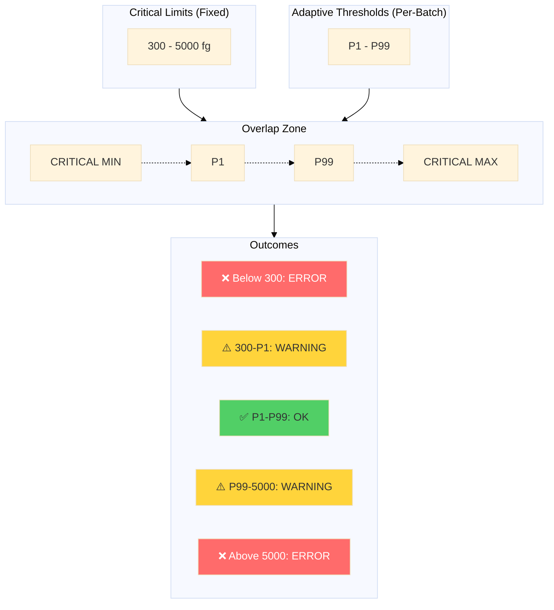

# Threshold Configuration

This page details how to configure and customise QC thresholds for your specific experimental conditions.

---

## Configuration File

All threshold settings are in `parsing/config.py`:

```python title="parsing/config.py"
# ═══════════════════════════════════════════════════════════════════
# QC Threshold Configuration
# ═══════════════════════════════════════════════════════════════════

# Adaptive (Percentile-Based) Thresholds
QC_PERCENTILE_MODE = True
QC_PERCENTILE_LOW = 1.0       # Bottom percentile (P1)
QC_PERCENTILE_HIGH = 99.0     # Top percentile (P99)
QC_MIN_SAMPLES_FOR_PERCENTILES = 30

# Critical Limits - DNA Yield (femtograms)
DNA_YIELD_CRITICAL_MIN = 300.0
DNA_YIELD_CRITICAL_MAX = 5000.0

# Critical Limits - Protein Yield (picograms)
PROTEIN_YIELD_CRITICAL_MIN = 20.0
PROTEIN_YIELD_CRITICAL_MAX = 2000.0
```

---

## Percentile Calculation



### Why 30 Samples Minimum?

With fewer than 30 data points, percentile estimates become unreliable. The system falls back to critical limits only.

---

## Adjusting Percentile Sensitivity

| Setting | Effect | Use Case |
|---------|--------|----------|
| P1/P99 (default) | Flags 2% of values | Standard screening |
| P5/P95 | Flags 10% of values | Strict QC |
| P0.1/P99.9 | Flags 0.2% of values | Relaxed QC |

To change:

```python
# Stricter thresholds (more warnings)
QC_PERCENTILE_LOW = 5.0
QC_PERCENTILE_HIGH = 95.0

# Looser thresholds (fewer warnings)
QC_PERCENTILE_LOW = 0.1
QC_PERCENTILE_HIGH = 99.9
```

---

## Critical Limit Rationale

### DNA Yield Limits



| Boundary | Value | Rationale |
|----------|-------|-----------|
| Minimum | 300 fg | Below typical qPCR detection limit |
| Maximum | 5,000 fg | Above indicates contamination or pipetting error |

### Protein Yield Limits

| Boundary | Value | Rationale |
|----------|-------|-----------|
| Minimum | 20 pg | Below BCA assay sensitivity |
| Maximum | 2,000 pg | Expression system saturation |

---

## Customising for Your Platform

### High-Throughput Screening

For 384-well assays with lower volumes:

```python
# Adjusted for microplate format
DNA_YIELD_CRITICAL_MIN = 150.0   # Lower detection
DNA_YIELD_CRITICAL_MAX = 3000.0  # Lower saturation
```

### Cell-Free Expression

For CFPS systems with higher yields:

```python
PROTEIN_YIELD_CRITICAL_MIN = 50.0
PROTEIN_YIELD_CRITICAL_MAX = 5000.0
```

---

## Threshold Interaction Diagram



---

## Special Cases

!!! warning "Adaptive Thresholds Inside Critical Limits"
    If your P1 calculates to 250 fg (below the 300 fg critical minimum), the critical limit takes precedence. Values below 300 fg are always errors.

!!! info "Small Batches"
    For batches with fewer than 30 samples, only critical limits apply. Consider pooling related experiments for threshold calculation.

---

## Testing Your Configuration

After modifying thresholds, run the test suite:

```bash
py -m pytest tests/test_qc.py -v
```

Check the threshold computation:

```python
from parsing.qc import compute_thresholds_from_records

# Your parsed records
thresholds = compute_thresholds_from_records(records)
print(f"DNA P1: {thresholds['dna_yield_low']}")
print(f"DNA P99: {thresholds['dna_yield_high']}")
```

---

## Related Topics

- [QC Overview](overview.md) - System architecture
- [Validation Checks](validation-checks.md) - All validation rules
