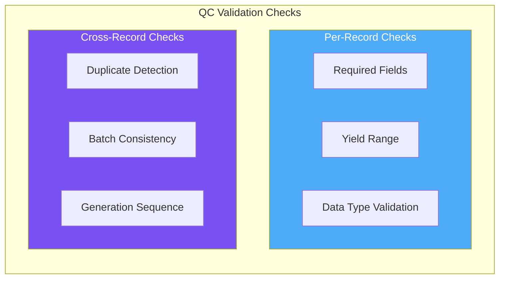
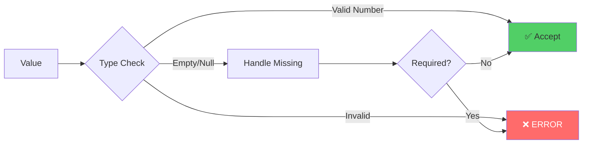
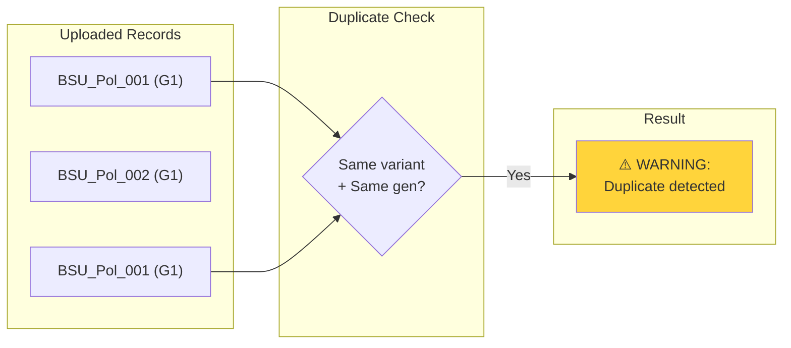
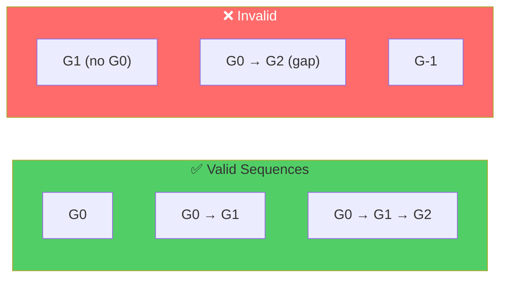
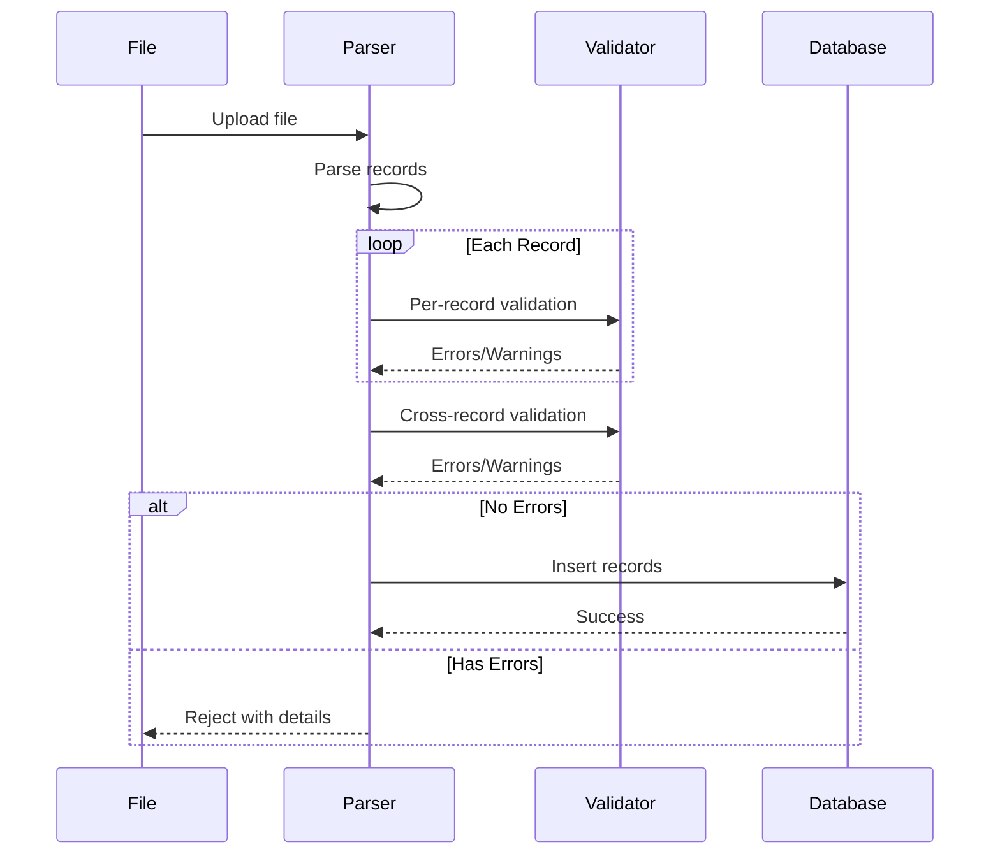

# Validation Checks

Complete reference of all validation checks performed by the QC system.

---

## Check Categories



---

## Per-Record Checks

These checks validate each row individually.

### 1. Required Fields

| Field | Required | Example |
|-------|----------|---------|
| `plasmid_variant_index` | ✅ Yes | `BSU_Pol_001` |
| `generation` | ✅ Yes | `G0`, `G1`, `G2` |
| `dna_yield_fg` | ✅ Yes | `1523.45` |
| `protein_yield_pg` | ✅ Yes | `456.78` |

!!! failure "Missing Field Error"
    ```
    ERROR: Row 45 - Missing required field: dna_yield_fg
    ```

---

### 2. Yield Range Validation

#### DNA Yield Checks

| Check Type | Condition | Result |
|------------|-----------|--------|
| **Critical Low** | `< 300 fg` | ❌ ERROR |
| **Warning Low** | `< P1` | ⚠️ WARNING |
| **Normal** | `P1 ≤ x ≤ P99` | ✅ OK |
| **Warning High** | `> P99` | ⚠️ WARNING |
| **Critical High** | `> 5000 fg` | ❌ ERROR |

#### Protein Yield Checks

| Check Type | Condition | Result |
|------------|-----------|--------|
| **Critical Low** | `< 20 pg` | ❌ ERROR |
| **Warning Low** | `< P1` | ⚠️ WARNING |
| **Normal** | `P1 ≤ x ≤ P99` | ✅ OK |
| **Warning High** | `> P99` | ⚠️ WARNING |
| **Critical High** | `> 2000 pg` | ❌ ERROR |

---

### 3. Data Type Validation



| Field | Expected Type | Invalid Examples |
|-------|---------------|------------------|
| `dna_yield_fg` | Float | `"N/A"`, `"pending"`, `""` |
| `protein_yield_pg` | Float | `"null"`, `"#REF!"`, `"-"` |
| `generation` | String | (must not be empty) |
| `plasmid_variant_index` | String | (must not be empty) |

---

## Cross-Record Checks

These checks validate relationships between records.

### 1. Duplicate Detection

Checks for duplicate `plasmid_variant_index` within the same generation.



!!! warning "Duplicate Warning"
    ```
    WARNING: Duplicate plasmid_variant_index 'BSU_Pol_001' in generation G1 (rows 12, 78)
    ```

---

### 2. Batch Consistency

Validates that batch metadata is consistent across files.

| Check | Description |
|-------|-------------|
| Experiment Name | Must match existing experiment or will be created |
| Generation Sequence | G0 → G1 → G2 (no gaps) |
| Wild Type Reference | Must exist in database |

---

### 3. Generation Sequence



---

## Check Execution Order



---

## Error vs Warning Behaviour

| Severity | Effect | Record Saved? |
|----------|--------|---------------|
| ❌ ERROR | Upload rejected | No |
| ⚠️ WARNING | Flagged but accepted | Yes |

!!! danger "One Error = Full Rejection"
    If **any** record has an error, the entire upload is rejected. Fix all errors before re-uploading.

---

## QC Report Structure

After validation, you receive a structured report:

```json
{
  "status": "warnings",
  "total_records": 301,
  "errors": [],
  "warnings": [
    {
      "row": 45,
      "field": "dna_yield_fg",
      "value": 312.5,
      "message": "Below P1 threshold (395.2)",
      "severity": "warning"
    },
    {
      "row": 198,
      "field": "protein_yield_pg", 
      "value": 1847.3,
      "message": "Above P99 threshold (1823.1)",
      "severity": "warning"
    }
  ],
  "thresholds_used": {
    "dna_yield_low": 395.2,
    "dna_yield_high": 1823.4,
    "protein_yield_low": 45.6,
    "protein_yield_high": 1789.2
  }
}
```

---

## Customising Checks

To add custom validation rules, modify `parsing/qc.py`:

```python
def custom_check(record: dict) -> list[dict]:
    """Add your custom validation logic."""
    warnings = []
    
    # Example: Flag specific variant patterns
    if "control" in record.get("plasmid_variant_index", "").lower():
        if record.get("dna_yield_fg", 0) < 500:
            warnings.append({
                "field": "dna_yield_fg",
                "message": "Control variant has unusually low yield"
            })
    
    return warnings
```

---

## Related Topics

- [QC Overview](overview.md) - Architecture explanation
- [Threshold Configuration](thresholds.md) - Adjust limits
