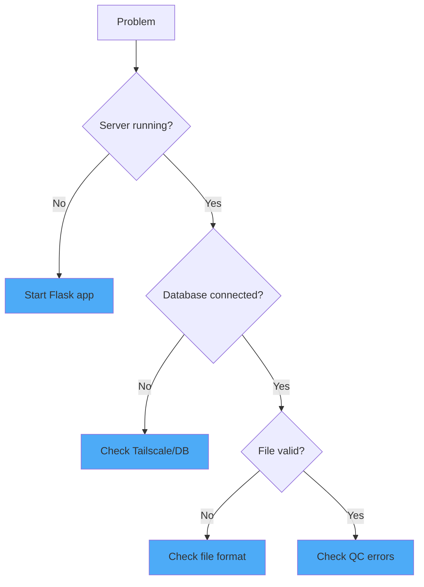

# Troubleshooting

Common issues and solutions for the parsing and QC system.

---

## Quick Diagnostics



---

## Connection Issues

### Flask Server Won't Start

!!! failure "Error: `python: command not found`"
    
    **Solution:** Use `py` instead of `python` on Windows:
    ```powershell
    py -m flask run
    ```

!!! failure "Error: `No module named flask`"
    
    **Solution:** Install dependencies:
    ```powershell
    py -m pip install -r requirements.txt
    ```

---

### Database Connection Timeout

!!! failure "Error: `connection to server at '100.x.x.x' failed: Connection timed out`"
    
    **Causes:**
    
    1. **Tailscale not connected**
        ```powershell
        tailscale status
        ```
        If offline, reconnect:
        ```powershell
        tailscale up
        ```
    
    2. **Database server offline** — Contact your teammate to start their machine
    
    3. **Wrong IP address** — Verify the Tailscale IP:
        ```powershell
        tailscale status | findstr teammate-machine
        ```

---

### Authentication Errors

!!! failure "Error: `password authentication failed for user`"
    
    **Solution:** Verify credentials in your environment or `DATABASE_URL`:
    ```python
    # Check current setting
    import os
    print(os.environ.get('DATABASE_URL'))
    ```

---

## Upload Issues

### File Format Errors

| Error | Cause | Solution |
|-------|-------|----------|
| `Unsupported file format` | Wrong extension | Use `.tsv` or `.json` |
| `Unable to parse file` | Malformed content | Check file encoding (UTF-8) |
| `Missing required column` | Column name mismatch | Use standard column names |

---

### QC Validation Errors

!!! failure "Error: `DNA yield below critical minimum (300 fg)`"
    
    **Meaning:** Value is below instrument detection limit
    
    **Solutions:**
    
    - Check if the measurement was correctly recorded
    - Verify units (fg not pg)
    - If valid, adjust critical limits in `config.py`

!!! failure "Error: `Protein yield above critical maximum (2000 pg)`"
    
    **Meaning:** Value indicates saturation or error
    
    **Solutions:**
    
    - Check for pipetting errors
    - Dilute sample and re-measure
    - If legitimate high-expresser, adjust limits

---

### Duplicate Key Errors

!!! failure "Error: `duplicate key value violates unique constraint`"
    
    **Meaning:** Trying to insert a record that already exists
    
    **Solution:** The system uses upsert logic—this should be handled automatically. If you see this error:
    
    1. Check that `db_operations.py` has the upsert logic for metrics
    2. Verify the constraint definition in the database

---

## QC Warnings

!!! warning "Warning: `Value below P1 threshold`"
    
    **Meaning:** This value is in the bottom 1% of your dataset
    
    **Action:** 
    
    - Review the sample—may be a biological outlier or technical error
    - If consistently low, check assay conditions
    - No action needed if sample is known low-performer

!!! warning "Warning: `Duplicate plasmid_variant_index detected`"
    
    **Meaning:** Same variant appears multiple times in the same generation
    
    **Action:**
    
    - If intentional replicates, no action needed
    - If data entry error, correct the source file

---

## Database Schema Issues

### Missing Tables

!!! failure "Error: `relation "experiments" does not exist`"
    
    **Solution:** Run the database migrations or create tables:
    ```python
    from parsing.models import db
    db.create_all()
    ```

### Column Mismatch

!!! failure "Error: `column "experiment_name" does not exist`"
    
    **Cause:** Model doesn't match database schema
    
    **Solution:** Verify column names in `parsing/models.py` match your database:
    ```python
    # Check: is it 'name' or 'experiment_name'?
    class Experiment(db.Model):
        name = db.Column(db.String)  # Not experiment_name
    ```

---

## Performance Issues

### Slow Uploads

| Symptom | Cause | Solution |
|---------|-------|----------|
| Upload hangs | Large file | Split into smaller batches |
| Slow QC | Many records | Normal for >10k records |
| Timeout | Network latency | Check Tailscale connection |

### Memory Errors

!!! failure "Error: `MemoryError` on large files"
    
    **Solution:** Process in batches:
    ```python
    # In routes.py, add batch processing
    BATCH_SIZE = 1000
    for i in range(0, len(records), BATCH_SIZE):
        batch = records[i:i+BATCH_SIZE]
        process_batch(batch)
    ```

---

## Checking System State

### Test Database Connection

```python
from parsing.db_operations import get_db_connection

conn = get_db_connection()
if conn:
    print("✅ Connected")
    conn.close()
else:
    print("❌ Connection failed")
```

### Test QC Thresholds

```python
from parsing.qc import compute_thresholds_from_records

# Create test data
test_records = [
    {"dna_yield_fg": 1000, "protein_yield_pg": 500}
    for _ in range(50)
]

thresholds = compute_thresholds_from_records(test_records)
print(thresholds)
```

### Run Test Suite

```powershell
py -m pytest tests/ -v
```

---

## Getting Help

1. **Check logs:** Flask prints errors to the terminal
2. **Run tests:** `py -m pytest tests/ -v`
3. **Check error details:** Look at the full traceback in the terminal
4. **Database state:** Query the database directly with `psql`

---

## Related Topics

- [Getting Started](guide/getting-started.md) - Initial setup
- [QC Overview](qc/overview.md) - Understanding thresholds
