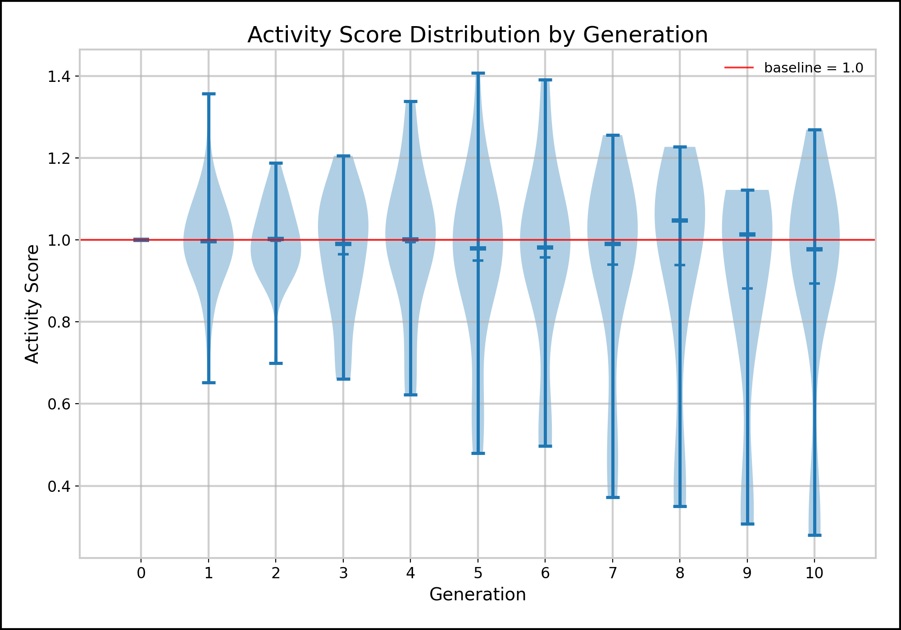

# Distribution plot

## Data sources
- Activity scores: `metrics` where `metric_name='activity_score'` and `metric_type='derived'`
- Variant and generation metadata: `variants`, `generations`

## Suggested filters
- Filter by `experiment_id`

## Endpoint
`/distribution/<experiment_id>`

Example:
`/distribution/41`

## SQL check
```sql
select
  g.generation_number,
  m.value as activity_score
from metrics m
join variants v on v.variant_id = m.variant_id
join generations g on g.generation_id = v.generation_id
where m.metric_name='activity_score'
  and m.metric_type='derived'
  and g.experiment_id = 41
order by g.generation_number;
```

## Interpretation
- Each violin summarizes the score distribution for one generation.
- Red baseline at `1.0` represents neutral normalized activity.
- Wider shapes indicate higher dispersion in that generation.

## Example graph

