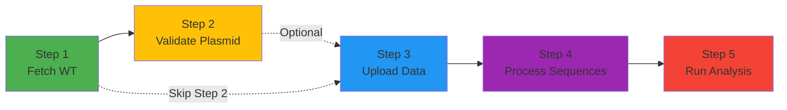

# Workflow Overview

The Direct Evolution Monitoring Portal follows a 5-step workflow for processing and analyzing directed evolution experiments. Each step builds on the previous one to create a complete analysis pipeline.

## The 5-Step Workflow

## Step Descriptions

### Step 1: Fetch Wild-Type (UniProt)

**Purpose:** Retrieve the reference protein sequence from UniProt.

- **Input:** UniProt accession (e.g., `O34996`)
- **Output:** Wild-type protein sequence, annotations, and features
- **Status Badge:** 🔵 1

**What it does:**

- Connects to UniProt API
- Retrieves protein sequence and metadata
- Stores annotations (domains, active sites, etc.)
- Creates or updates experiment workspace

**Required:** ✅ Yes - First step, required for all subsequent steps

[📖 Step 1 Guide](step1-fetch-wildtype.md)

---

### Step 2: Validate Plasmid

**Purpose:** Validate that plasmid DNA encodes the wild-type protein.

- **Input:** Plasmid FASTA file (DNA sequence)
- **Output:** Validation status (pass/fail), identity %, coverage %
- **Status Badge:** 🟡 2

**What it does:**

- Parses FASTA file
- Performs 6-frame translation (forward + reverse strands)
- Searches for exact or approximate match
- Reports strand, frame, and quality metrics

**Required:** ⚠️ Optional - Can skip to Step 3 if plasmid validation not needed

[📖 Step 2 Guide](step2-validate-plasmid.md)

---

### Step 3: Upload Data

**Purpose:** Upload and parse variant data from your experiment.

- **Input:** TSV, CSV, or JSON file with variant records
- **Output:** Parsed records, variants, and generations stored in database
- **Status Badge:** 🔵 3

**What it does:**

- Parses file format (auto-detects TSV/CSV/JSON)
- Validates required fields
- Creates variant and generation records
- Performs quality checks and reports warnings
- Stores DNA sequences and measurements

**Required:** ✅ Yes - Data source for all downstream analysis

**Expected Data Fields:**

| Field | Type | Description | Required |
|-------|------|-------------|----------|
| `variant_index` | Integer | Unique variant identifier | ✅ |
| `generation` | Integer | Generation number (0 for wild-type) | ✅ |
| `parent_variant_index` | Integer | Parent variant (empty for gen 0) | ✅ |
| `assembled_dna_sequence` | String | DNA sequence (A/T/G/C) | ✅ |
| `dna_yield` | Numeric | DNA yield measurement | ✅ |
| `protein_yield` | Numeric | Protein yield measurement | ✅ |

[📖 Step 3 Guide](step3-upload-data.md)

---

### Step 4: Process Sequences

**Purpose:** Translate DNA to protein and identify mutations.

- **Input:** Stored variant DNA sequences from Step 3
- **Output:** Protein sequences, mutation calls, activity scores
- **Status Badge:** 🟣 4

**What it does:**

- Translates assembled DNA sequences to protein
- Aligns protein sequences to wild-type reference
- Calls mutations (substitutions, insertions, deletions)
- Calculates activity scores and metrics
- Stores results in `variant_sequence_analysis` table

**Required:** ✅ Yes - Needed for analysis and visualization

**This is an automated step** - After clicking "Run Sequence Processing", the system handles all computation in the background.

[📖 Step 4 Guide](step4-process-sequences.md)

---

### Step 5: Run Analysis

**Purpose:** Generate visualizations and analysis reports.

- **Input:** Processed sequences and mutations from Step 4
- **Output:** PNG plots, CSV files, interactive visualizations
- **Status Badge:** 🔴 5

**What it does:**

- Generates activity distribution plot
- Creates lineage tree visualization
- Computes top 10 variants ranking
- Builds protein similarity network
- Optionally generates bonus visualizations (PCA landscape, mutation fingerprints, domain enrichment)

**Required:** ⚠️ Recommended - Final step to visualize results

**Outputs:**

- `activity_distribution.png` - Histogram of activity scores
- `lineage.png` - Directed graph of variant lineage
- `top10_variants.png` - Bar chart of top performers
- `protein_similarity.png` - Network graph of sequence similarity
- `top10_variants.csv` - Detailed top variants table
- Bonus visualizations (optional)

[📖 Step 5 Guide](step5-run-analysis.md)

---

## Step Dependencies

Understanding which steps depend on others:

| Step | Depends On | Can Skip? |
|------|------------|-----------|
| Step 1 | None | ❌ No - Required |
| Step 2 | Step 1 | ✅ Yes - Optional |
| Step 3 | Step 1 | ❌ No - Required |
| Step 4 | Step 3 | ❌ No - Required |
| Step 5 | Step 4 | ⚠️ Recommended |

## Workflow States

The stepper bar at the top of the workspace shows your progress:

- **Pending** (gray) - Step not yet started
- **Active** (highlighted) - Currently working on this step
- **Complete** (green checkmark) - Step successfully completed
- **Error** (red x) - Step failed, needs attention

## Best Practices

### Start with Quality Control

- Validate your wild-type protein in Step 1
- Use Step 2 to verify plasmid sequences match expectations
- Review warnings in Step 3 carefully

### Check Data Before Processing

Before running Steps 4-5:

1. Review upload summary in Step 3
2. Check for critical warnings (duplicates, missing fields, orphan variants)
3. Fix data issues and re-upload if needed

### Monitor Progress

- The stepper bar updates automatically as you complete steps
- Each step shows a status badge (Pending/Complete/Error)
- Expand steps to see detailed summaries and re-run if needed

### Re-running Steps

Most steps can be re-run:

- **Step 1:** Re-fetch to update wild-type protein (may affect downstream analysis)
- **Step 2:** Re-upload a different plasmid file
- **Step 3:** Re-upload corrected data (replaces previous upload)
- **Step 4:** Re-run if Step 3 data changed
- **Step 5:** Re-run to regenerate visualizations with updated data

## Typical Timeline

For a typical experiment:

| Step | Time Required |
|------|---------------|
| Step 1 | ~5-10 seconds |
| Step 2 | ~5-15 seconds |
| Step 3 | ~10-60 seconds (depends on file size) |
| Step 4 | ~1-10 minutes (depends on variant count) |
| Step 5 | ~30-120 seconds |

!!! tip "Background Processing"
    Steps 4 and 5 run in the background. You can leave the page and return later to check results.

## Getting Help

If you encounter issues:

1. Check the [Troubleshooting Guide](../troubleshooting/common-issues.md)
2. Review error messages and badge statuses
3. Consult individual step guides for detailed instructions
4. Contact support if problems persist

---

**Next Steps:**

- Begin with [Step 1: Fetch Wild-Type](step1-fetch-wildtype.md)
- Review [Step 2: Validate Plasmid](step2-validate-plasmid.md)
- See the [Troubleshooting Guide](../troubleshooting/common-issues.md) for common issues
