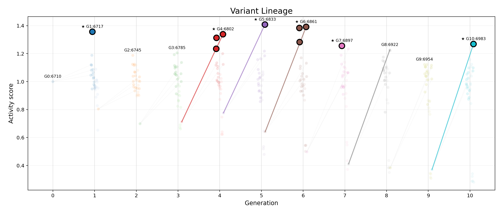

# Lineage plot

## Data sources
- Top variants per generation: `variant_performance_rankings`
- Mutation introduction events: `mutation_introduction_events`
- Domain enrichment summary: `mv_domain_mutation_enrichment`

## Suggested inputs
- Fingerprinting: `target_variant_id`, `introduced_generation_id`, `position`, `original`, `mutated`
- Domain bars: `domain_label`, `nonsyn_count`, `domain_length`, `nonsyn_per_residue`

## Example graph

