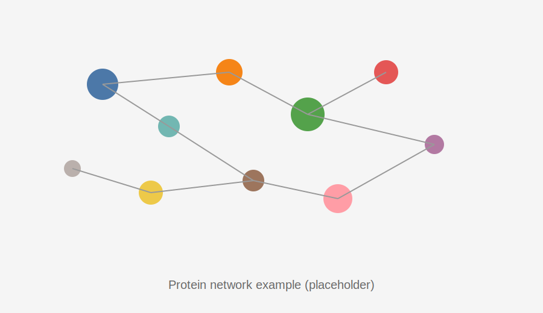

# Protein network

## Data sources
- Sequence identity mode: `variants.protein_sequence` + `metrics.activity_score`
- Mutation co-occurrence mode: `mutations` (protein) + `metrics.activity_score`

## Tunable parameters
- Identity threshold
- Minimum shared mutations
- Optional Jaccard threshold

## Example graph

Replace this placeholder by generating a protein network PNG and saving it in `user_guide_mkdocs/docs/assets/plots/`.
