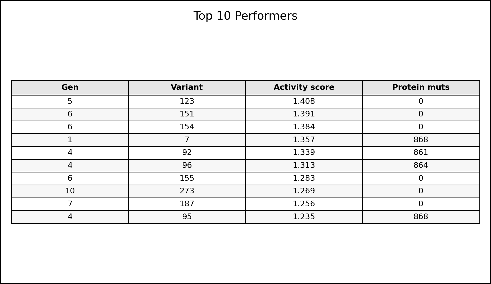

# Top 10 table

## Data sources
- Rankings: `variant_performance_rankings`
- Activity scores: `metrics` where `metric_name='activity_score'` and `metric_type='derived'`
- Mutation counts: `mutations` (protein)

## Suggested filters
- Filter by `experiment_id` and `generation_id`

## Example graph

